# Github pagesで遊ぼう！
---
### Github pagesとは？
Github pagesとは、Githubが提供する静的Webサイトのホスティングサービスです。
 
Q.いやGithubってなんだよ  
A.Githubとは、プログラムを複数人で管理できるGitというシステムをはじめとした色々を提供しているサイトです。プログラムを開発する人は一人であることが少なく、さらに常に一緒の場所で働いているわけじゃないのでこのようにインターネット上でプロジェクトの管理をできるサービスが人気です。

Q.静的Webサイトってなんだよ  
A.静的Webサイトとは、すごくざっくりいうと「いつ、だれが、どこで、」見ても内容が変わらないサイトのことです。コメント欄とかがあるものは反対に動的Webサイトとか言われます。

Q.Github pagesってなんだよ  
A.上で書いたように、Githubはプロジェクトを進める場として利用されているようですが、自分たちが進めているプロジェクトの広報や簡単な紹介のためにGithubが管理領域にあるファイルをWebサイトとして公開する機能をつけてくれているようです(多分)。太っ腹。

### Github pagesでサイトを公開するまでの流れ(画像付き)
1. [Github](https://github.com/)にアクセスして、サインアップする。
2. New repositoryを選択する。(repositoryとは、プロジェクトのコードをアップロードしておくための場所です。  )
  
	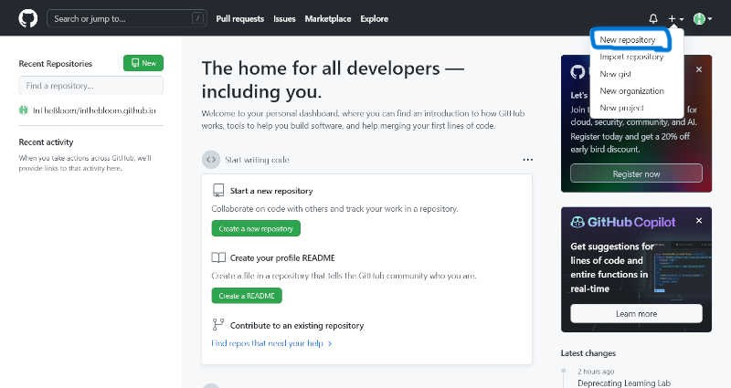

3. 下の画像は手順2を行った画面です。ここで、いくつか入力します。詳しくは下の表を参照してください。

	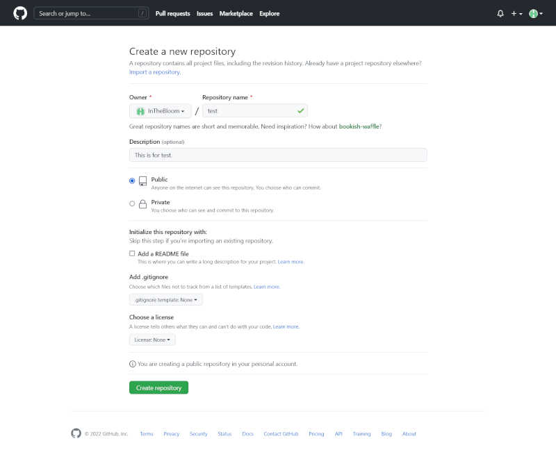

	| 項目 | 説明 | 記入例 |
	| :--- | :--- | :--- |
	| Repository name | 作成するリポジトリの名前(必須)(下に追記あり) | test |
	| Descripption | リポジトリの説明 | This is for test. |
	| 公開設定 | ripositoryの公開範囲設定 public : 誰でも閲覧可能 private : 自分または許可のあるユーザーのみ | public |
	| Initialize this repository with Add a README file | 詳細は下に | Add a README file |
	| ~ with Add.gitignore | GitHubにアップしたくないファイルやディレクトリを指定(詳細は下に) | None |
	| ~ with Choose a license | Repositoryのファイルに対するライセンスを指定 | None |

	- Repository nameについて

	これはRepositoryの名前を決める項目です。ここで選択した名前を用いてhttps://[ユーザー名].github.io/[決めたリポジトリ名]という公開ディレクトリが与えられます。ただし例外的に自分のユーザー名をリポジトリ名に定めた場合はurlがhttps://[ユーザー名].github.ioになります。

	- Initialize this repository with Add a README fileについて

	上述したurlに対するアクセスがあった場合、(アクセスするファイルを定めなかった場合)Github pagesのエンジンはREADME.mdまたはindex.htmlまたはindex.mdを探します。つまり、https://[ユーザー名].github.io/[リポジトリ名]に対するアクセスがあったときに、このディレクトリにREADME.mdまたはindex.htmlまたはindex.mdがあればそれを表示してくれます。この項目は、そのファイルを先に作っておくか決める設定になります。どっちでもいいです。

	- Initialize this repository with Add.gitignoreについて

	gitシステムの真骨頂は、ローカルで作業したファイルをこのgithub上で(複数人で)管理するというものです。この設定は(多分)ローカルからネット上のリポジトリに戻すときにアップロードしたくないファイルを指定するものです。ただWebサイトで遊びたいだけの人は関係ないと思うのでNoneでいいと思います。(要出典)

4. Create Repositoryを押して、リポジトリ作成完了です。
5. 公開まであともう少しです！手順4まで終わったらおそらく次のような画面になっていると思います。

	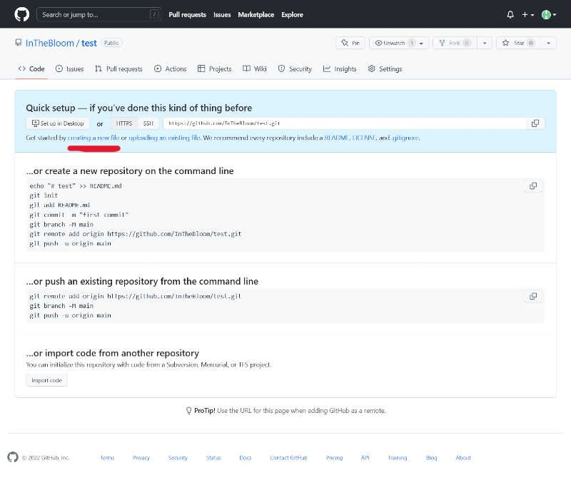

	正直自分もGithubのこと全然わかっていないので、これらのメニューを正確に説明することができません。ごめんなさい。ただ、とりあえずWebサイトを公開するだけなら上の画像で赤線を引いてある所のcreating a new fileを選択すればOKです。

6. 次の画像が手順5を実行した画面になります。

	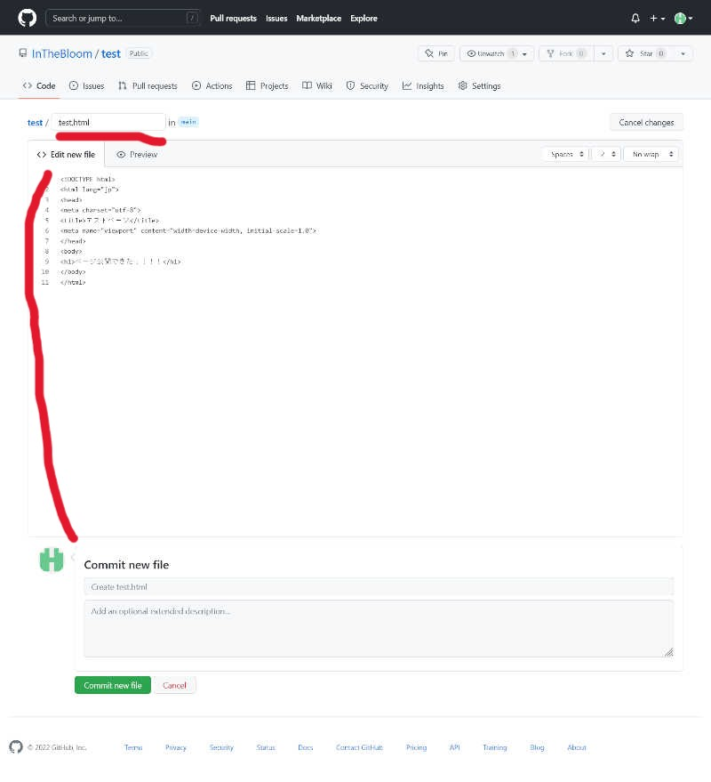

	ファイル名とファイルの中身を打ち込んで下のほうの`Commit new file`を押しましょう。もちろん事前に準備したファイルをコピペしてもOKです。ちなみにCommit new fileという見出しの下に入力欄がありますが、多分今回のような使い方の場合関係ないと思います(気になる人は調べてみてね)。

7. ファイルの公開設定をしていきます。まずは画像下線部の`Settings`を選択してください。次に`Pages`を選択してください。

	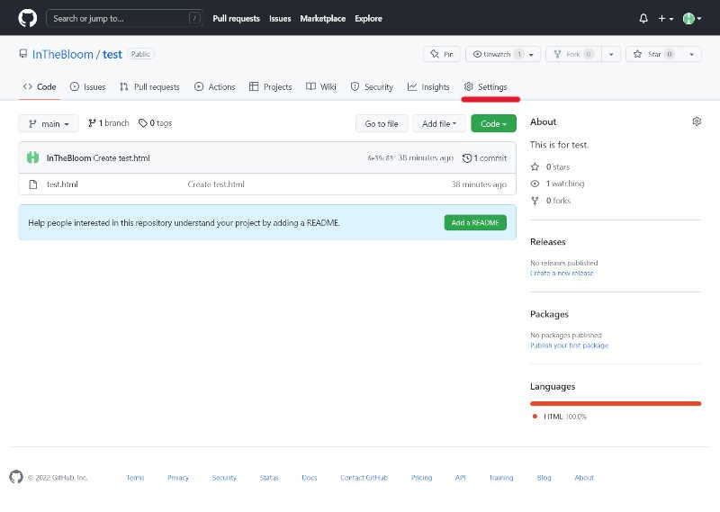

	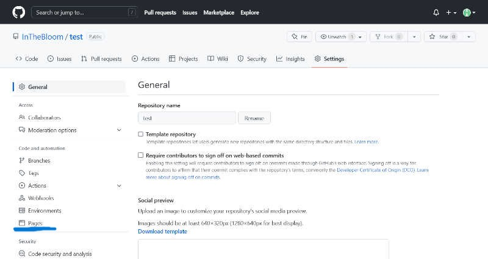

	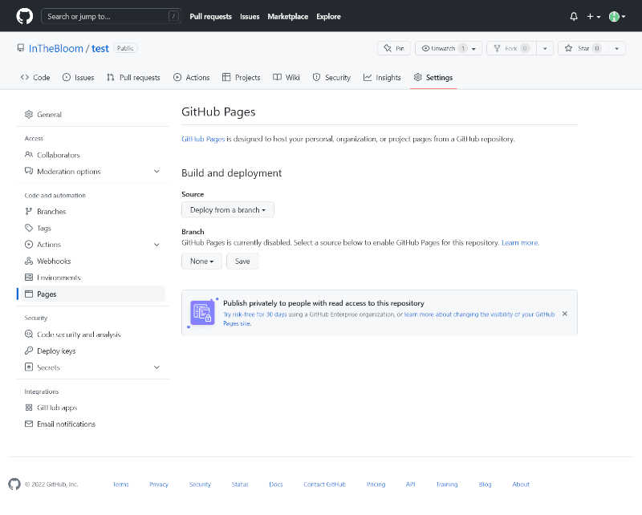

8. Branchの項目を`None`から`main`に変更してください。そのあと`save`を選択してください。Branchを`main`にすると横にもう一つ選択項目が出るかと思いますが、それは(おそらく)エントリファイル(README.mdみたいなやつ)を探すフォルダを定めるというものだと思うので、`root`のままで構いません。

しばらく待ってからページをリロードすると、公開されているページのリンクがこのページに出てきます。

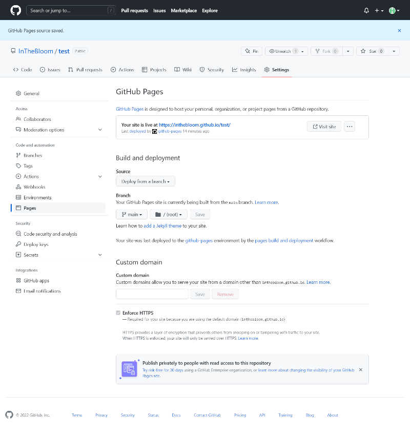

これで公開完了です！やったね！

### 少々補足
上の公開設定のところ何をしているのかよくわからなかったかもしれません。少しだけ補足説明を入れます。  
まずGitHubのリポジトリはBranchというものがあるようです。これはリポジトリの中で一番大きな仕分け(？)機構のようなものだと思えばいいと思います。自分は勝手にフォルダのようなものだと思っています。先ほどの設定は、(ブランチをたくさん持つリポジトリもあるだろうから)公開ページをどのブランチにするのかを設定しました(なお、最初に作られるブランチの名前はmainになっているそうです。)。ここで選ばれたブランチの中身をWeb上に公開してくれるようです。下に私が書いたくそかっこいいイメージ画像置いときます。

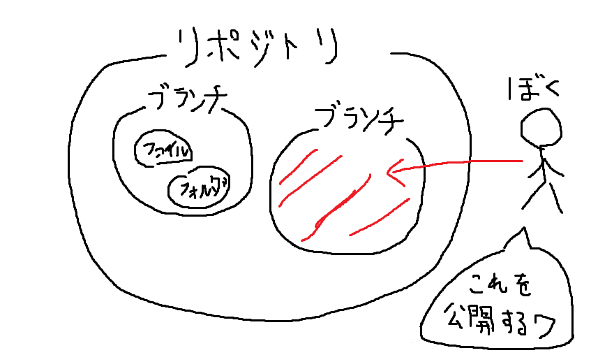

さて、本当に公開できているかアクセスしてみましょう。上の補足説明からわかる通り、現在の設定ではmainブランチがルートフォルダのようになっているようです。(ルートフォルダについては[こちら](https://ja.wikipedia.org/wiki/ルートディレクトリ)を参照してください。)ですから、作成した`test.html`は[https://InTheBloom.github.io/test/test.html](https://InTheBloom.github.io/test/test.html)で見れるはずです。できているかどうかご確認ください。

ファイルを新規作成/訂正する方法も紹介しておきます。2回目以降も困らないようにGitHubにアクセスした画面から説明します。

- ファイル新規作成

1. GitHubログインページから`your repositories`を選択

	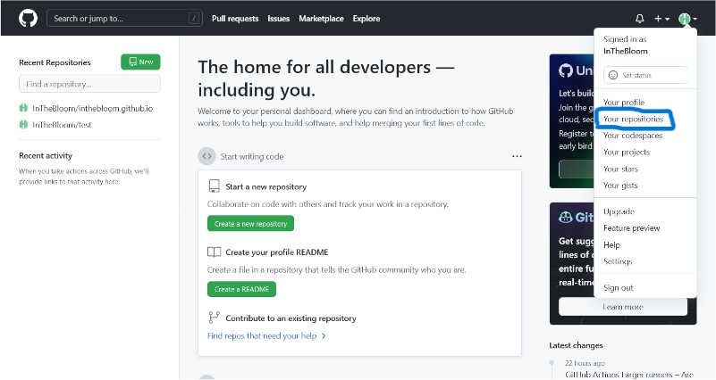

2. 公開中のリポジトリを選択します。(今回であれば`test`を選びます。)

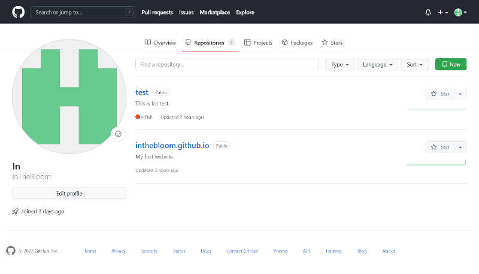

次に`Add file`を選択します。

そのあと`Create new file`または`Upload files`を選択します。

`Create new file`の方は上で紹介した手順6と同様です。コピペまたは打ち込んで`Commit new file`を選択すればOKです。また、この時ファイル名に/を入れることで入れ子のディレクトリを作ることができます。

`Upload files`の方はドラッグアンドドロップして`Commit changes`を選択すると完了です。

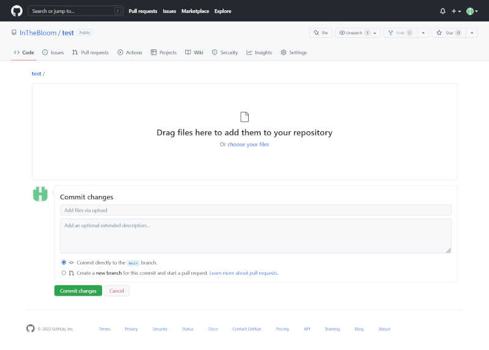

- ファイル訂正

上の手順2までと同様にリポジトリまで行きます。そして、訂正したいファイルの**ファイル名のところ**を選択します。

そして以下の画像のところから`Edit this file`を選択して、ファイル名と中身に変更を加えたら`Commit changes`を選択します。ちなみに印の横のボタンはファイル消去のボタンです。ファイル消去も同様に`Commit changes`を選択すると完了です。

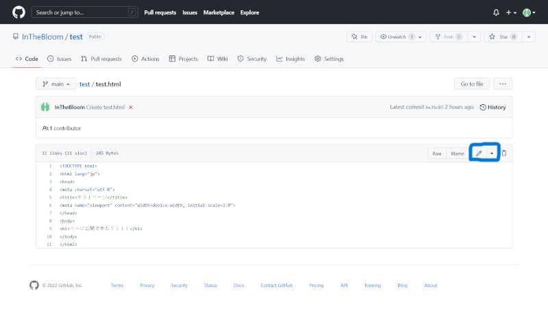

ついでになりますが、どうやら静的Webサイトであればjavascriptなどにも対応してるみたいです。どこまでできるのかわかりませんが、とても夢が広がっていいですね。

### 終わりに
ここまで読んでいただきありがとうございました。この記事はかなり適当な解説をしているため、ビミョーなところも間違ったところもあるかもしれません。問題点があれば[私のTwitter](https://twitter.com/UU9782wsEdANDhp)までお知らせいただければ幸いです。

### 参考
[What is GitHub Pages?](https://pages.github.com/)

[GitHub Pages サイトを作成する](https://docs.github.com/ja/pages/getting-started-with-github-pages/creating-a-github-pages-site)

[GitHub Pages を使うには？](https://developer.mozilla.org/ja/docs/Learn/Common_questions/Using_Github_pages)
